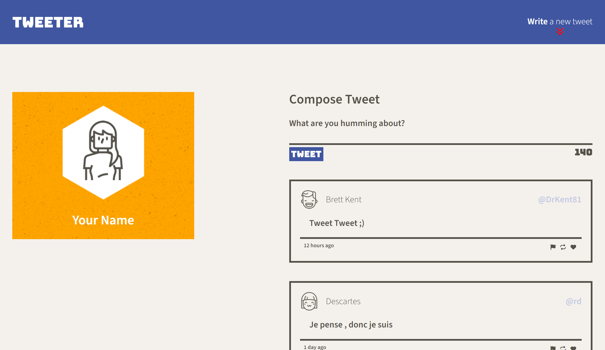
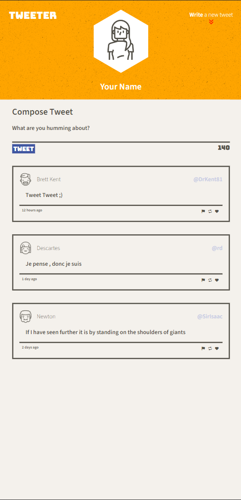

# Tweeter Project

Tweeter is a simple, single-page Twitter clone. Made for the Lighthouse Labs Web Development program to develop familiarity with HTML, CSS, JavaScript, jQuery, and AJAX.

The layout is accurate to the demands made within the course, rather than my own design preferences. Just saying! ;)

## Features
- Responsive design for mobile and desktop using media queries.
- Dynamic DOM editing using jQuery.
- Fetches tweets with AJAX.
- Basic security to prevent user-made scripts from running.

## Getting Started

1. [Create](https://docs.github.com/en/repositories/creating-and-managing-repositories/creating-a-repository-from-a-template) a new repository using this repository as a template.
2. Clone your repository onto your local device.
3. Install dependencies using the `npm install` command.
3. Start the web server using the `npm start` command. The app will be served at <http://localhost:8080/>.
4. Go to <http://localhost:8080/> in your browser.

## Screenshots

